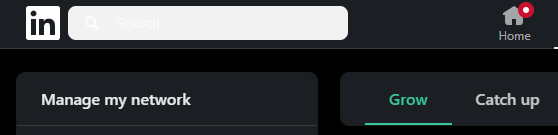
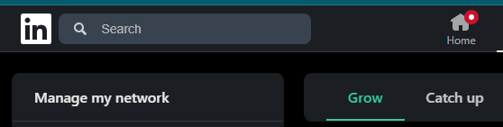

## **Introduction**

In our digitally connected world, platforms like LinkedIn have become indispensable for professional networking and growth. With the increasing adoption of dark mode across applications---aimed at reducing eye strain and conserving device battery life---users expect a seamless experience regardless of their display preferences.

Recently, I encountered a perplexing visual glitch on LinkedIn's website that not only disrupted my user experience but also highlighted a critical aspect of web development: the necessity of thorough testing. This blog post delves into the technical intricacies of the issue, explores potential causes, and underscores how even industry giants can falter without rigorous testing protocols.


## **Discovering the invisble Search bar**

While navigating LinkedIn in dark mode, I clicked on the **My Network** tab to explore new connections. Immediately, I noticed something was amiss. The search bar at the top of the page appeared unusually light against the dark background, and the search icon along with any text I typed was virtually invisible unless I hovered over the search bar.



This anomaly was not present on other tabs like **Home**, **Jobs**, or **Messaging**, where the search bar blended seamlessly with the dark theme. Intrigued and slightly frustrated, I decided to investigate the root cause of this inconsistency.


### **Technical Investigation: Peeling Back the Layers**

As a web developer, I turned to the browser's developer tools to inspect the problematic element. Here's what I found:

The CSS class responsible for styling the search bar's background was:

```
._139m7kni {
    background-color: var(--pdntct85);
}
```
The variable `--pdntct85` was supposed to define the background color. However, on the **My Network** page, this variable didn't resolve to any valid color. This resulted in the search bar defaulting to a light background, which clashed with the dark mode theme and rendered the text and icons invisible.


### **Unearthing the Correct Color Variable**

To find the correct color, I navigated to the **Home** tab where the search bar displayed correctly. Inspecting the search bar there revealed that it used a different variable:

```
._139m7kni {
    background-color: var(--voyager-color-background-input-search);
}`
```
Digging deeper, I discovered that `--voyager-color-background-input-search` was set using another variable:


```
--voyager-color-background-input-search: var(--var-grey-80);
```
Further tracing led me to:

```
--var-grey-80: #38434f;
```
This hex code `#38434f` corresponds to the appropriate dark grey color that ensures the search bar integrates smoothly with the dark theme, making text and icons visible.


### **Understanding the Root Cause: Why Was the Variable Inaccessible?**

The crux of the issue lay in the fact that `--voyager-color-background-input-search` and its associated variables were not accessible on the **My Network** page. Possible reasons include:

1.  **Scoped CSS Variables:** CSS variables can be scoped to specific elements or components. If `--voyager-color-background-input-search` was defined within a scope not present on the **My Network** page, it wouldn't be available there.

2.  **Missing CSS Files or Imports:** The CSS file or stylesheet segment defining the necessary variables might not have been imported into the **My Network** page's HTML.

3.  **Caching Issues:** There could have been a caching problem where the latest styles weren't loaded on the **My Network** page.

4.  **Deployment Oversight:** During updates or deployments, the style definitions for the **My Network** page might have been overlooked, causing discrepancies.


### **Applying the Fix**

To test my findings, I manually adjusted the CSS directly in the browser:

1.  **Override the Background Color:**

    I modified the background color of the search bar class to use the correct hex value:
    ```
    ._139m7kni {
        background-color: #38434f !important;
    }
    ```
2.  **Verify the Changes:**

    Upon refreshing the page, the search bar now displayed correctly, with the dark background and visible icons and text.

    

This confirmed that the absence of the correct variable definition was causing the issue.


### **Cross-Browser Validation**

To ensure the problem wasn't isolated to a specific browser, I tested the issue across different browsers and devices:

-   **Google Chrome**
-   **Mozilla Firefox**
-   **Safari**

The issue was consistent across all platforms, indicating a systemic problem affecting all users accessing the **My Network** tab in dark mode.


## **Delving Deeper: How Could This Happen at LinkedIn?**

It's important to recognize that large organizations often have complex codebases and multiple teams working concurrently on different features. Here's how such an oversight could occur:

1.  **Siloed Development Teams:** Different teams may handle different sections of the website. If the team responsible for the **My Network** page wasn't fully aligned with shared styling conventions, inconsistencies can arise.

2.  **Incomplete Style Integration:** Global styles or variables might not have been properly integrated into all components, leading to missing definitions on certain pages.

3.  **Updates and Regression Issues:** Recent updates to the dark mode theme or the introduction of new style variables may not have been thoroughly tested across all pages, resulting in regressions.

4.  **Priority and Resource Allocation:** With tight deadlines and prioritization of new features over maintenance, minor UI issues can slip through the cracks.


## **The Importance of Thorough Testing**

This experience highlights several key lessons for developers and organizations:

1.  **Consistency in Shared Resources:** Ensure that all pages and components have access to global style variables and resources.

2.  **Comprehensive Testing Across All Pages:**

    -   **Unit Testing:** While unit tests focus on individual components, they may not catch integration issues.
    -   **Integration Testing:** Tests that cover interactions between components could reveal missing variables.
    -   **Visual Regression Testing:** Automated tools can capture screenshots of pages to detect visual discrepancies.
3.  **Cross-Functional Collaboration:** Encourage communication between teams responsible for different parts of the application to maintain consistency.

4.  **User-Centric Approach:** Remember that even minor visual issues can significantly impact user experience and perception of quality.


## **Preventative Measures: How This Could Have Been Avoided**

To prevent issues like the dark mode glitch on LinkedIn's My Network tab, it's crucial to adopt strategies that enhance consistency and quality assurance throughout the development process. Implementing a centralized style guide ensures all teams use the same design principles and CSS variables, reducing discrepancies caused by miscommunication or outdated practices. Automating style checks within the development workflow—using tools like linters and build systems—can detect undefined variables or missing styles during development, catching errors early before they reach production. Incorporating comprehensive testing at every stage of the deployment pipeline through Continuous Integration and Deployment (CI/CD) practices ensures code changes are rigorously evaluated before deployment, including visual regression tests to detect unintended UI alterations. Conducting regular audits of all web pages and components, especially after significant updates or redesigns, helps identify inconsistencies and maintain the integrity of the user experience across the entire platform. By embracing these preventative measures, organizations can significantly reduce the risk of visual glitches reaching production, ultimately enhancing the overall quality and reliability of their websites.

## **Conclusion**

Discovering this dark mode glitch on LinkedIn's **My Network** tab was an eye-opening experience. It demonstrated that even the most established platforms are not immune to oversights, and it reinforced the critical importance of thorough testing and quality assurance in web development.

As developers and users, we must advocate for meticulous attention to detail and robust testing practices. Doing so not only enhances user experience but also upholds the integrity and reputation of the platforms we build and rely upon.