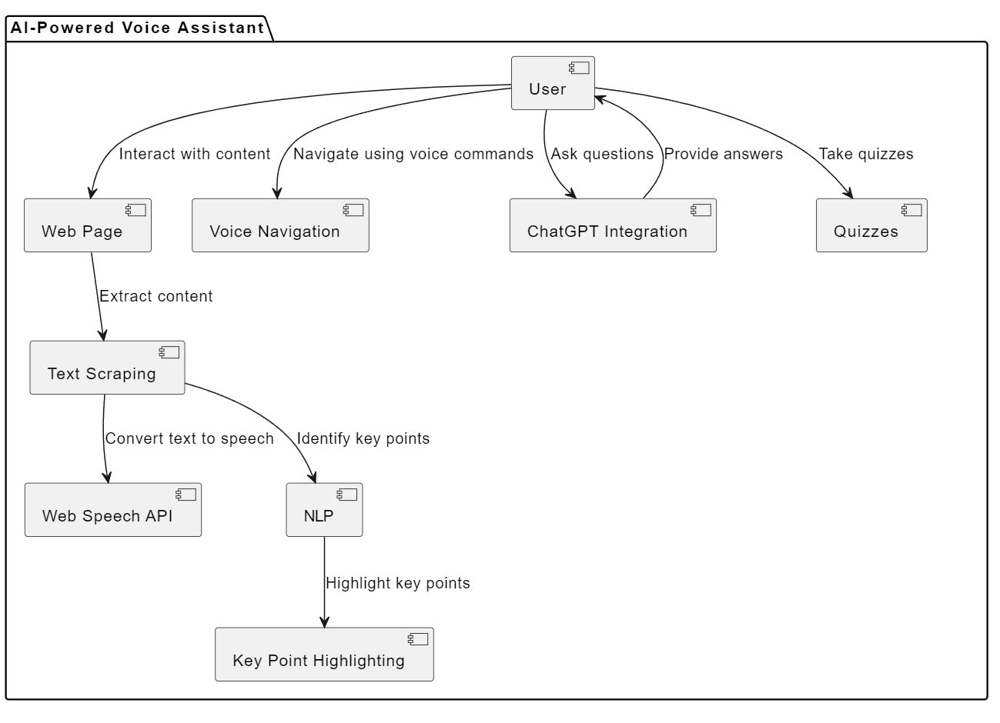
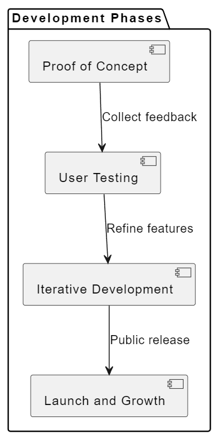

**Introduction**

Hey there! 👋 I'm always buzzing with ideas, and lately, I've been obsessing over one in particular: an AI-powered voice assistant Chrome extension that could totally change the way we experience the web. It's still just a twinkle in my eye, and I'll only get to build it if time allows, but let me paint you a picture of what it *could* be...

**My Vision: Reading, But Make it Interactive**

Picture this: You're scrolling through the internet, and you find an article that sparks your interest. But maybe you're on the go, or your eyes are tired, or you just prefer to *listen* to stuff. With my extension, you'd just click a button, and boom! The article starts reading itself to you in a friendly, natural voice. It'd be like having your own personal storyteller, letting you multitask or just chill while soaking up new knowledge.

But I'm not stopping there. I want to make reading *way* more engaging.

-   **Highlight Reel:** The extension would pick out the most important bits and highlight them for you, so you can easily spot the key takeaways. No more getting lost in a sea of words!
-   **Curious? Just Ask!** Have a question about what you just heard? No worries! The extension would use some clever AI (think ChatGPT) to give you instant answers and explanations. It's like having a super-smart study buddy right there with you.
-   **Quiz Time!** Did you know that taking a quick quiz after learning something new can help you remember it *way* better? It's true! Research shows we can retain up to 50% more information that way (Roediger & Karpicke, 2006). So, my extension would whip up a fun little quiz after each article, just to make sure everything's sinking in.
-   **Smooth Sailing:** Forget about clicking around to get to the next page. This extension would know its way around a website, letting you navigate with just your voice. "Next page, please!"

**The Techy Stuff: Making the Magic Happen**

Okay, so how would this all work? Well, I'd probably use a mix of cool technologies:

-   **Text Scraping:** I'd likely use a library like BeautifulSoup (in Python) or Cheerio (in JavaScript) to extract the main article content from web pages. This involves identifying the HTML elements that hold the text and filtering out any unwanted elements like ads or sidebars. It'll be a bit of a challenge to make it work across different website layouts, but I'm up for it!

-   **ChatGPT Integration:** The OpenAI API would be my go-to for integrating ChatGPT. I'd send the scraped text to the API and use its powerful language understanding capabilities to generate summaries, answer questions, and create quizzes. To make the interactions feel natural and conversational, I'd probably use a prompt engineering approach, carefully crafting the instructions I give to ChatGPT.

-   **Web Speech API:** This one's built right into modern browsers, which is awesome! I'd use JavaScript to access the API and convert the text to speech. I'd also explore different voices and settings to make the listening experience as pleasant as possible.

-   **Key Point Highlighting:** This is where things get interesting. I could use natural language processing techniques to identify the most important sentences in the text. Or, I could train a machine learning model to recognize patterns and predict which parts of the text are likely to be key points. It's a bit of a research project, but that's part of the fun!

-   **Seamless Navigation:** I'd need to figure out how to identify buttons and links on web pages reliably. Maybe I could use some combination of HTML attributes, CSS selectors, and even computer vision techniques to detect clickable elements. Once identified, I'd use JavaScript to simulate clicks or trigger other actions based on voice commands.

**Cost Considerations:**

When it comes to the financial side of things, I'll need to factor in the cost of using the OpenAI API, as ChatGPT usage isn't free.  I might need to set some usage limits or explore subscription options to make sure things stay sustainable. Additionally, if I want to store user data or add features like syncing progress across devices, web hosting and database storage will also come into play. And let's not forget the biggest investment of all – my own time and energy! Building a truly awesome extension is going to take dedication and ongoing refinement.

**Next Steps: From Dream to Reality**

If I get the chance to pursue this project, i would follow the following diagram:

1.  **Proof of Concept:** Build a basic version with core features like text-to-speech and simple Q&A to validate the idea.

2.  **User Testing:** Gather feedback from early users to refine the design and identify areas for improvement.

3.  **Iterative Development:** Gradually add more advanced features like key point highlighting, personalized quizzes, and seamless navigation.

4.  **Launch and Grow:** Release the extension to the public and continue iterating based on user feedback and evolving technology.

**The Big Picture: Making the Web More Fun and Accessible**

I truly believe this extension could change the way we experience the internet. It could make learning more fun, help us understand complex stuff better, and even make the web more accessible for people who have trouble reading.

**The Journey Ahead**

This is all still a dream for now, but if I can find the time, I'm so excited to dive in and see what I can create. Who knows, maybe this little idea could turn into something really special!

**Join Me!**

If you're a developer, educator, or simply someone who shares my passion for innovative learning tools, I'd love to hear from you! Let's work together to build the future of reading.
{: .info}

**Let's Chat!** What other features would make this extension even cooler? How would *you* use it to make your life easier or more interesting? I'm all ears!